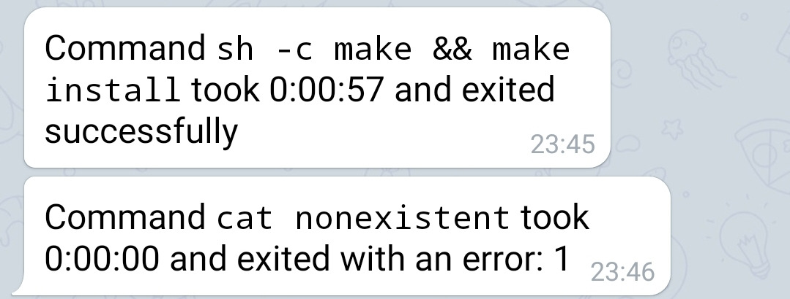

bellbot
=======

We all know that "compile" time can be used for fun purposes:

.. image:: https://imgs.xkcd.com/comics/compiling.png

Sometimes, however, you'd like to actualyl go and do something else while your code is compiling...

Like terminal bells, often used to notify when commands complete executing: bellbot notifies you using Telegram, to your phone!

Usage
-----

1. `Create a bot <https://core.telegram.org/bots#3-how-do-i-create-a-bot>`_ and write down your token.
2. Start a chat with your bot (you can find it in the search after it is created)
3. Get your chat ID using ``python-telegram-bot`` as mentioned `here <https://github.com/python-telegram-bot/python-telegram-bot/wiki/Code-snippets#reply-to-messages>`_, or if you're lazy use the following: ``curl https://api.telegram.org/bot<YOUR_TOKEN>/getUpdates | python -c 'import json, sys; print(json.load(sys.stdin)["result"][0]["message"]["from"]["id"])'``.
4. ``echo YOUR_TOKEN > ~/.config/bellbot; echo CHAT_ID >> ~/.config/bellbot``.
5. ``cp bellbot.py ~/bin/bellbot`` or any other directory in your ``PATH``.

To test it, run run ``bellbot sleep 2`` and you should get a message within a few seconds.
